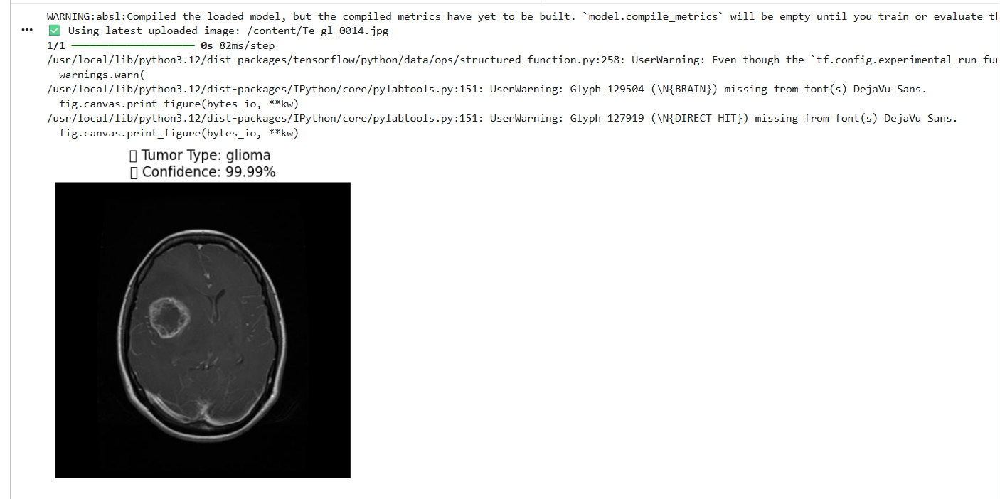
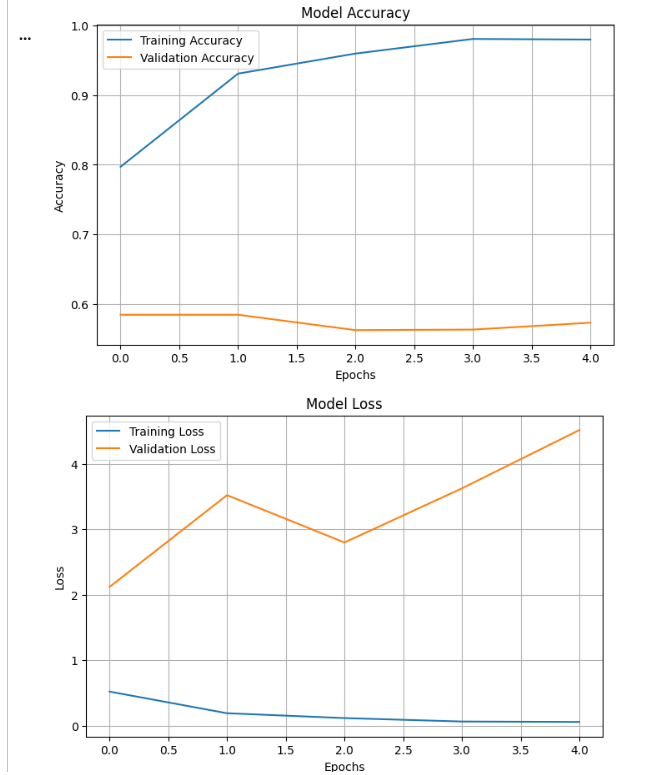
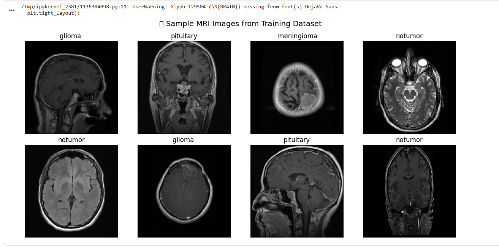
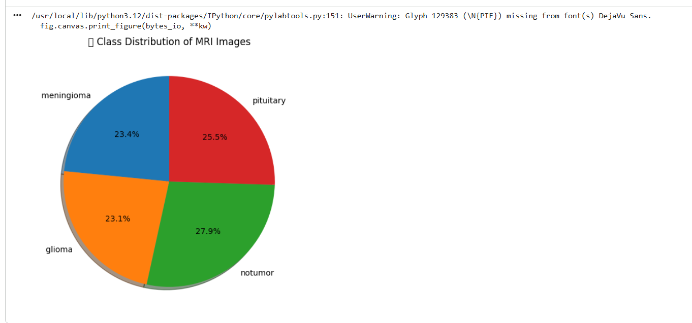

# 🧠 Brain Tumor Prediction using Deep Learning

A Deep Learning based Brain Tumor Prediction System developed using TensorFlow, Keras, and Convolutional Neural Networks (CNN) for MRI image classification.

## 📌 Project Overview

This project classifies brain MRI scans into one of the following categories:

- Glioma
- Meningioma
- Pituitary Tumor
- No Tumor

The model is trained on MRI images and predicts the tumor type with a confidence score.

---

## 🚀 Features

- MRI Brain Scan Classification
- CNN-based Deep Learning Model
- Tumor Type Prediction
- Confidence Score Generation
- Data Visualization
- Accuracy and Loss Graphs

---

## 🛠 Technologies Used

- Python
- TensorFlow
- Keras
- NumPy
- Matplotlib
- Google Colab

---

## 📂 Project Structure

Brain_Tumor_Prediction/
│
├── Brain_Tumor_Prediction.ipynb
├── model.h5
├── README.md
├── LICENSE
└── .gitignore

---

## 📊 Dataset

Dataset Source:

https://www.kaggle.com/datasets/masoudnickparvar/brain-tumor-mri-dataset

Classes:

- Glioma
- Meningioma
- Pituitary
- No Tumor

Note: The dataset is not included in this repository because of its large size.

---

## 🧠 Model Architecture

- Conv2D
- MaxPooling2D
- Flatten Layer
- Dense Layers
- Softmax Output Layer

---
## 📈 Results

- Training Accuracy: ~98%
- MRI Tumor Classification
- Confidence Score Prediction

### Prediction Result

### Accuracy and Loss Graph

### Sample MRI Images

### Dataset Distribution

---

## 🌐 Live Demo

Try the deployed application here:

🔗 https://braintumorprediction-s7vx6wjbzeayhtptiqyfho.streamlit.app/

---

## 🔮 Future Enhancements

- Improve model accuracy using advanced deep learning architectures.
- Integrate Explainable AI (Grad-CAM) for tumor region visualization.
- Implement patient report generation in PDF format.
- Add prediction history storage using cloud databases.
- Enable secure user authentication and access control.
- Develop a responsive mobile-friendly interface.
- Support multilingual accessibility.
- Deploy a scalable cloud-based production environment.
---

## 👨‍💻 Author

Akash N
